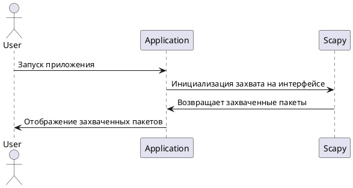
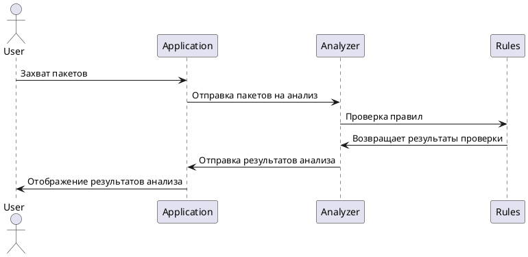
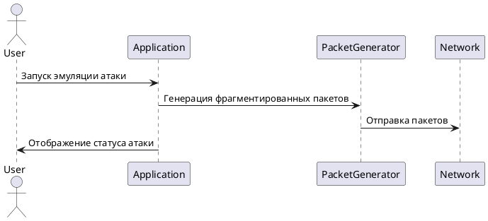
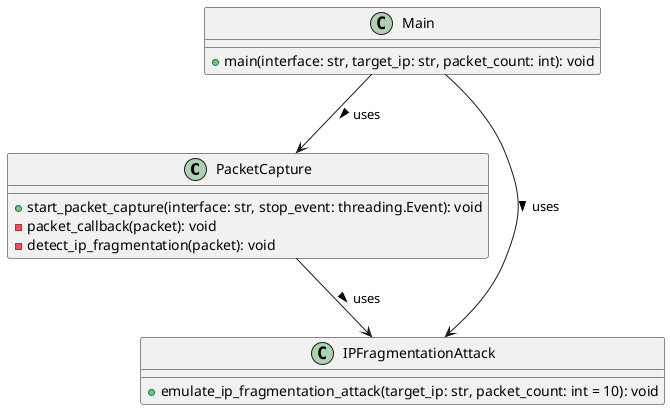
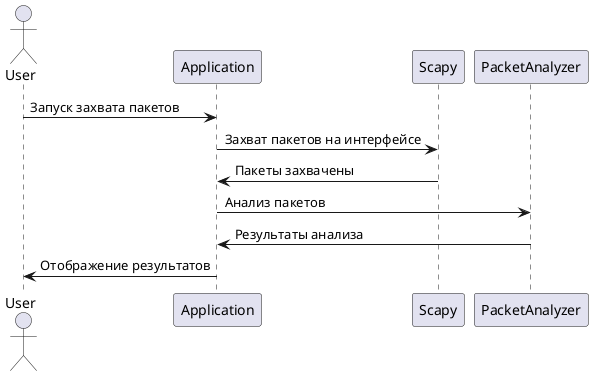

# Аннотация работы приложения "Система обнаружения сетевых аномалий"

## Общее описание
"Система обнаружения сетевых аномалий" предназначена для захвата сетевых пакетов, анализа их на наличие аномалий и эмуляции атак для тестирования системы.

## Архитектура системы
Архитектура приложения состоит из следующих компонентов:
- Захват сетевых пакетов.
- Анализ пакетов.
- Эмуляция атак.
- Логирование результатов.

## Основные алгоритмы

### Захват сетевых пакетов
Алгоритм захвата сетевых пакетов использует библиотеку Scapy для прослушивания указанного сетевого интерфейса и захвата всех проходящих пакетов.

#### Диаграмма последовательности для захвата сетевых пакетов

#### Диаграмма последовательности для анализа пакетов

#### Диаграмма последовательности для эмуляции атаки с фрагментацией IP

#### Диаграмма классов

#### Диаграмма последовательностей для захвата и анализа пакетов с последующим отобраением
